::: {.callout-note appearance="minimal"}
**Disciplina:** Análise de Séries Temporais\
**Professor:** Prof. Dr. Pedro Monteiro de Almeida Júnior\
**Instituição:** UEPB – Centro de Ciências e Tecnologia – CCT
:::

------------------------------------------------------------------------

## Resumo {.unnumbered}

A análise de séries temporais constitui ferramenta fundamental para compreender fenômenos que evoluem ao longo do tempo, permitindo identificar padrões como tendência e sazonalidade e auxiliando na construção de modelos de previsão. Este trabalho tem como objetivo analisar o comportamento temporal de duas séries com características distintas: o número de embarques mensais em voos domésticos e internacionais de companhias aéreas dos Estados Unidos, obtido via plataforma FRED, no período de janeiro de 2000 a janeiro de 2026; e o percentual anual de usuários de internet no Brasil, obtido via FRED, no período de 1990 a 2024. A primeira série apresenta tendência de crescimento associada a forte sazonalidade anual, enquanto a segunda exibe apenas tendência ascendente, sem padrão sazonal. As séries foram estruturadas no ambiente R com o pacote `tsibble` e submetidas a análise exploratória, incluindo gráficos sazonais, funções de autocorrelação (ACF e PACF) e decomposição clássica. Para previsão, foram ajustados modelos de suavização exponencial (ETS), avaliados no conjunto de teste por métricas de acurácia, com destaque para o MAPE como critério principal de seleção. Os resultados indicaram que o modelo Holt-Winters Multiplicativo apresentou o melhor desempenho para a série de embarques aéreos (MAPE de aproximadamente 3,84%), enquanto o modelo de Suavização Exponencial Simples obteve o melhor resultado para a série de usuários de internet (MAPE de aproximadamente 2,21%). Os achados reforçam a importância da análise exploratória na escolha de modelos adequados às características de cada série.

**Palavras-chave:** Séries temporais; Modelos ETS; Suavização exponencial; Transporte aéreo; Acesso à internet.

------------------------------------------------------------------------

## Introdução

A análise de séries temporais constitui uma importante área da Estatística voltada ao estudo de observações coletadas sequencialmente ao longo do tempo. Diferentemente de conjuntos de dados independentes, as observações de uma série temporal geralmente apresentam dependência temporal, de modo que valores passados podem influenciar valores futuros (CHATFIELD, 2004) \[4\]. O principal objetivo da análise de séries temporais é compreender os mecanismos geradores dos dados e utilizar esse conhecimento para descrever padrões e realizar previsões (BOX et al., 2015) \[3\].

O comportamento de uma série temporal pode ser compreendido por meio da identificação de seus principais componentes, entre os quais se destacam a tendência, a sazonalidade, os ciclos e a componente aleatória (ANTUNES; CARDOSO, 2015) \[1\]. A análise desses elementos permite compreender a dinâmica dos dados ao longo do tempo e auxilia na construção de modelos adequados para descrição e previsão da série.

Entre os métodos amplamente utilizados na modelagem de séries temporais, destacam-se os modelos de suavização exponencial, que atribuem pesos decrescentes às observações passadas, priorizando os valores mais recentes (HYNDMAN; ATHANASOPOULOS, 2021) \[9\]. Esses modelos apresentam bom desempenho prático devido à simplicidade, flexibilidade e capacidade de representar diferentes combinações de tendência e sazonalidade, destacando-se os métodos de Holt e Holt-Winters, amplamente empregados em previsão de demanda.

Além da modelagem propriamente dita, ferramentas como a decomposição de séries temporais, a função de autocorrelação (ACF) e a função de autocorrelação parcial (PACF) são amplamente utilizadas para auxiliar na identificação da estrutura temporal dos dados (MORETTIN; TOLOI, 2018) \[10\]. Essas técnicas permitem avaliar a presença de dependência serial, tendências e padrões sazonais, fornecendo informações importantes para a compreensão do comportamento da série e para a seleção de modelos apropriados.

O transporte aéreo desempenha um papel fundamental na economia mundial, contribuindo para a integração de mercados, a mobilidade de pessoas e o desenvolvimento econômico (OLIVEIRA, 2009) \[12\]. A demanda por esse serviço está fortemente relacionada à distribuição de renda da população, de modo que reduções na desigualdade tendem a intensificar a sensibilidade da demanda aos preços das passagens (FRAZÃO; OLIVEIRA, 2020) \[6\]. Nesse contexto, compreender sua evolução ao longo do tempo é essencial para o planejamento do setor. Para isso, este estudo utiliza o índice de embarques mensais de passageiros em voos regulares operados por companhias aéreas dos Estados Unidos, obtido junto ao Bureau of Transportation Statistics (BTS) por meio da plataforma Federal Reserve Economic Data (FRED) \[2\].

Complementarmente, também é analisada a série anual do percentual de usuários de internet no Brasil. A expansão do acesso à internet nas últimas décadas está diretamente relacionada aos avanços tecnológicos, à ampliação da infraestrutura de telecomunicações e ao processo de inclusão digital da população (UIT, 2023) \[15\]. Dessa forma, a análise dessa série permite investigar um contexto distinto daquele observado no setor aéreo, caracterizado principalmente por uma trajetória ascendente ao longo do tempo. Para isso, este estudo utiliza a série anual do percentual de indivíduos que utilizaram a internet no Brasil, obtida junto ao Banco Mundial (World Bank) por meio da plataforma Federal Reserve Economic Data (FRED) \[21\].

Diante desse contexto, o presente trabalho tem como objetivo analisar o comportamento temporal das séries de embarques aéreos nos Estados Unidos e do percentual de usuários de internet no Brasil, identificando seus principais padrões e avaliando o desempenho de diferentes modelos de suavização exponencial para fins de previsão.

------------------------------------------------------------------------

## Materiais e Métodos

### Conjunto de Dados e Pré-processamento

Os dados foram coletados a partir do Banco da Reserva Federal de St. Louis (FRED) \[5\], sendo organizados em duas colunas: data (mensal e anual) e índice (embarques em voos e percentual de usuários com internet). As datas foram convertidas para o formato `yearmonth` (mensal) e `year` (anual), e a série foi estruturada utilizando o pacote `tsibble` dentro do R, o que permite utilizar o ecossistema moderno de séries temporais \[16\].

A série mensal com sazonalidade — embarques em voos domésticos e internacionais regulares de passageiros de companhias aéreas dos EUA \[2\] — ocorre entre o período de janeiro de 2000 a janeiro de 2026, contendo 313 observações. Já a série anual com tendência — Usuários com Internet no Brasil \[21\] — ocorre entre o período de 1990 a 2024, contendo 35 observações. Para avaliação dos modelos, foi adotada a seguinte divisão para cada série:

::::: columns
::: {.column width="50%"}
**Série mensal com sazonalidade:**

-   **Conjunto de treino:** janeiro/2000 a janeiro/2025 (301 observações)
-   **Conjunto de teste:** fevereiro/2025 a janeiro/2026 (12 observações)
:::

::: {.column width="50%"}
**Série anual com tendência:**

-   **Conjunto de treino:** 1990 a 2020 (31 observações)
-   **Conjunto de teste:** 2021 a 2024 (4 observações)
:::
:::::

### Análise Exploratória

A análise exploratória compreendeu:

1.  Visualização da série original;
2.  Análise descritiva dos dados;
3.  Gráfico sazonal (`gg_season`) e gráfico de subséries (`gg_subseries`) para identificar a estrutura mensal da sazonalidade;
4.  Funções de Autocorrelação (ACF) e Autocorrelação Parcial (PACF) com até 20 *lags*;
5.  Decomposição clássica aditiva e multiplicativa da série.

A função de autocorrelação (ACF) mede o grau de associação linear entre observações da série separadas por uma defasagem (*lag*) $k$, sendo estimada por:

$$
r_k = \frac{\displaystyle\sum_{t=k+1}^{T}(y_t-\bar{y})(y_{t-k}-\bar{y})}{\displaystyle\sum_{t=1}^{T}(y_t-\bar{y})^2}
$$ {#eq-acf}

em que $y_t$ representa o valor da série no instante $t$, $\bar{y}$ é a média amostral e $T$ é o número total de observações.

A função de autocorrelação parcial (PACF), por sua vez, mede a correlação entre $y_t$ e $y_{t-k}$ após remover o efeito das defasagens intermediárias $y_{t-1}, y_{t-2}, \dots, y_{t-k+1}$, sendo obtida por meio da recursão de Durbin-Levinson:

$$
\phi_{kk} = \frac{\displaystyle r_k - \sum_{j=1}^{k-1}\phi_{k-1,j}\,r_{k-j}}{\displaystyle 1-\sum_{j=1}^{k-1}\phi_{k-1,j}\,r_j}\,, \qquad
\phi_{kj} = \phi_{k-1,j}-\phi_{kk}\,\phi_{k-1,k-j}\,, \quad j=1,\dots,k-1
$$ {#eq-pacf}

em que $\phi_{kk}$ corresponde ao valor da PACF na defasagem $k$.

Para a decomposição clássica, a série $y_t$ é representada pela combinação de três componentes: tendência-ciclo ($T_t$), sazonalidade ($S_t$) e resíduo ($R_t$). No esquema aditivo:

$$
y_t = T_t + S_t + R_t
$$ {#eq-decomp-add}

e no esquema multiplicativo:

$$
y_t = T_t \times S_t \times R_t
$$ {#eq-decomp-mult}

A componente de tendência-ciclo é estimada por meio de uma média móvel centrada de ordem igual ao período sazonal $m$, $\hat{T}_t = \text{MM}_{2\times m}(y_t)$; a componente sazonal $\hat{S}_t$ é obtida pela média dos valores destendenciados ($y_t-\hat{T}_t$, no caso aditivo, ou $y_t/\hat{T}_t$, no caso multiplicativo) para cada período sazonal; e o resíduo é calculado como $\hat{R}_t = y_t-\hat{T}_t-\hat{S}_t$ (aditivo) ou $\hat{R}_t = y_t/(\hat{T}_t\hat{S}_t)$ (multiplicativo).

### Modelos de Suavização Exponencial (ETS)

Os modelos ETS \[8\] são compostos por três componentes: erro ($E$), tendência ($T$) e sazonalidade ($S$), em que cada componente pode ser Aditivo (A), Multiplicativo (M) ou Ausente (N). Foram estimados os seguintes modelos para cada série:

::::: columns
::: {.column width="50%"}
**Tabela 1 – Modelos ETS para série sazonal**

| Sigla   | Notação ETS | Descrição                      |
|---------|-------------|--------------------------------|
| SES     | ETS(A,N,N)  | Suavização Exponencial Simples |
| HoltA   | ETS(A,A,N)  | Holt Aditivo                   |
| HoltM   | ETS(M,A,N)  | Holt Multiplicativo            |
| HW_Add  | ETS(A,A,A)  | Holt-Winters Aditivo           |
| HW_Mult | ETS(M,A,M)  | Holt-Winters Multiplicativo    |
:::

::: {.column width="50%"}
**Tabela 2 – Modelos ETS para série com tendência**

| Sigla   | Notação ETS | Descrição                              |
|---------|-------------|----------------------------------------|
| SES     | ETS(A,N,N)  | Suavização Exponencial Simples         |
| HoltA   | ETS(A,A,N)  | Holt Aditivo                           |
| HoltM   | ETS(M,A,N)  | Holt Multiplicativo                    |
| HWDampA | ETS(A,Ad,N) | Holt-Winters Amortecido Aditivo        |
| HWDampM | ETS(M,Ad,N) | Holt-Winters Amortecido Multiplicativo |
:::
:::::

Considerando $\ell_t$ o nível, $b_t$ a tendência, $s_t$ a componente sazonal, $m$ o período sazonal, $h$ o horizonte de previsão, $\alpha,\beta^{*},\gamma\in[0,1]$ os parâmetros de suavização e $\phi\in(0,1)$ o parâmetro de amortecimento, as equações de cada modelo são apresentadas a seguir.

**Suavização Exponencial Simples (SES):**

$$
\hat{y}_{t+h|t}=\ell_t\,, \qquad \ell_t=\alpha y_t+(1-\alpha)\ell_{t-1}
$$ {#eq-ses}

**Holt Aditivo:**

$$
\hat{y}_{t+h|t}=\ell_t+hb_t
$$ {#eq-holt1}

$$
\ell_t=\alpha y_t+(1-\alpha)(\ell_{t-1}+b_{t-1})\,, \qquad b_t=\beta^{*}(\ell_t-\ell_{t-1})+(1-\beta^{*})b_{t-1}
$$ {#eq-holt2}

**Holt-Winters Aditivo:**

$$
\hat{y}_{t+h|t}=\ell_t+hb_t+s_{t+h-m(k+1)}
$$ {#eq-hwadd1}

$$
\ell_t=\alpha(y_t-s_{t-m})+(1-\alpha)(\ell_{t-1}+b_{t-1})
$$ {#eq-hwadd2}

$$
b_t=\beta^{*}(\ell_t-\ell_{t-1})+(1-\beta^{*})b_{t-1}\,, \qquad s_t=\gamma(y_t-\ell_{t-1}-b_{t-1})+(1-\gamma)s_{t-m}
$$ {#eq-hwadd3}

**Holt-Winters Multiplicativo:**

$$
\hat{y}_{t+h|t}=(\ell_t+hb_t)\,s_{t+h-m(k+1)}
$$ {#eq-hwmult1}

$$
\ell_t=\alpha\dfrac{y_t}{s_{t-m}}+(1-\alpha)(\ell_{t-1}+b_{t-1})
$$ {#eq-hwmult2}

$$
b_t=\beta^{*}(\ell_t-\ell_{t-1})+(1-\beta^{*})b_{t-1}\,, \qquad s_t=\gamma\dfrac{y_t}{\ell_{t-1}+b_{t-1}}+(1-\gamma)s_{t-m}
$$ {#eq-hwmult3}

**Tendência Amortecida (HWDampA e HWDampM):**

$$
\hat{y}_{t+h|t}=\ell_t+(\phi+\phi^2+\dots+\phi^h)b_t
$$ {#eq-damp1}

$$
\ell_t=\alpha y_t+(1-\alpha)(\ell_{t-1}+\phi b_{t-1})\,, \qquad b_t=\beta^{*}(\ell_t-\ell_{t-1})+(1-\beta^{*})\phi b_{t-1}
$$ {#eq-damp2}

em que $k$ é a parte inteira de $(h-1)/m$, garantindo que sejam utilizadas as estimativas sazonais do último ano completo disponível.

### Avaliação do Desempenho

Os modelos foram avaliados no conjunto de teste pelas seguintes métricas:

| Sigla | Nome | Descrição |
|------------------------|------------------------|------------------------|
| ME | Mean Error | Erro Médio |
| RMSE | Root Mean Squared Error | Raiz do Erro Quadrático Médio |
| MAE | Mean Absolute Error | Erro Absoluto Médio |
| MPE | Mean Percentage Error | Erro Percentual Médio |
| **MAPE** | **Mean Absolute Percentage Error** | **Erro Percentual Absoluto Médio — critério principal** |
| MASE | Mean Absolute Scaled Error | Erro Absoluto Médio Escalado |
| RMSSE | Root Mean Squared Scaled Error | Raiz do Erro Quadrático Médio Escalado |
| ACF1 | Autocorrelation Function at Lag 1 | Autocorrelação dos resíduos na defasagem 1 |

Considerando $e_t = y_t-\hat{y}_t$ o erro de previsão no instante $t$, $n$ o número de observações do conjunto de teste, $T$ o tamanho da série de treino e $m$ o período sazonal, as métricas são calculadas como:

$$
\text{ME}=\frac{1}{n}\sum_{t=1}^{n}e_t\,, \qquad
\text{RMSE}=\sqrt{\frac{1}{n}\sum_{t=1}^{n}e_t^2}\,, \qquad
\text{MAE}=\frac{1}{n}\sum_{t=1}^{n}|e_t|
$$ {#eq-me-rmse-mae}

$$
\text{MPE}=\frac{100}{n}\sum_{t=1}^{n}\frac{e_t}{y_t}\,, \qquad
\text{MAPE}=\frac{100}{n}\sum_{t=1}^{n}\left|\frac{e_t}{y_t}\right|
$$ {#eq-mpe-mape}

$$
\text{MASE}=\frac{1}{n}\sum_{t=1}^{n}\frac{|e_t|}{Q}\,, \qquad
\text{RMSSE}=\sqrt{\frac{\dfrac{1}{n}\displaystyle\sum_{t=1}^{n}e_t^2}{Q^2}}\,, \qquad
Q=\frac{1}{T-m}\sum_{t=m+1}^{T}|y_t-y_{t-m}|
$$ {#eq-mase-rmsse}

$$
\text{ACF1}=\frac{\displaystyle\sum_{t=2}^{n}(e_t-\bar{e})(e_{t-1}-\bar{e})}{\displaystyle\sum_{t=1}^{n}(e_t-\bar{e})^2}
$$ {#eq-acf1}

em que $Q$ corresponde ao erro médio absoluto de um modelo *naïve* sazonal ajustado ao conjunto de treino, utilizado para escalonar o MASE e o RMSSE, e $\bar{e}$ é a média dos resíduos do modelo no conjunto de teste.

Como critério de seleção principal do melhor modelo, foi utilizado o menor **MAPE**.

### Ferramentas Computacionais

Toda a análise foi conduzida utilizando a linguagem de programação R \[14\] com o software RStudio versão 4.5.2 \[13\], com os seguintes pacotes principais:

| Pacote            | Finalidade                             |
|-------------------|----------------------------------------|
| `readr` \[19\]    | Leitura de dados                       |
| `dplyr` \[17\]    | Manipulação de dados                   |
| `lubridate` \[7\] | Conversão de datas                     |
| `ggplot2` \[18\]  | Visualização gráfica                   |
| `tsibble` \[16\]  | Estruturação de séries temporais       |
| `feasts` \[11\]   | Exploração de sazonalidade e tendência |
| `fpp3` \[9\]      | Modelagem e previsão                   |
| `tidyr` \[20\]    | Organização de dados                   |

------------------------------------------------------------------------

## Resultados e Discussão

### Embarques em Voos Domésticos e Internacionais – EUA

#### Visualização da Série

A @fig-serie-embarques apresenta a série original de embarques aéreos, que exibe tendência de crescimento acompanhada de forte sazonalidade ao longo de todo o período analisado. É possível notar, pela análise visual, que entre 2001 e 2002 houve um pequeno declínio nos embarques, devido aos ataques de 11 de setembro, e uma queda ainda maior em 2020, devido à pandemia de COVID-19, tendo, logo no ano seguinte, mostrado recuperação rápida e retornado ao padrão sazonal e à trajetória de crescimento até o final do período analisado.

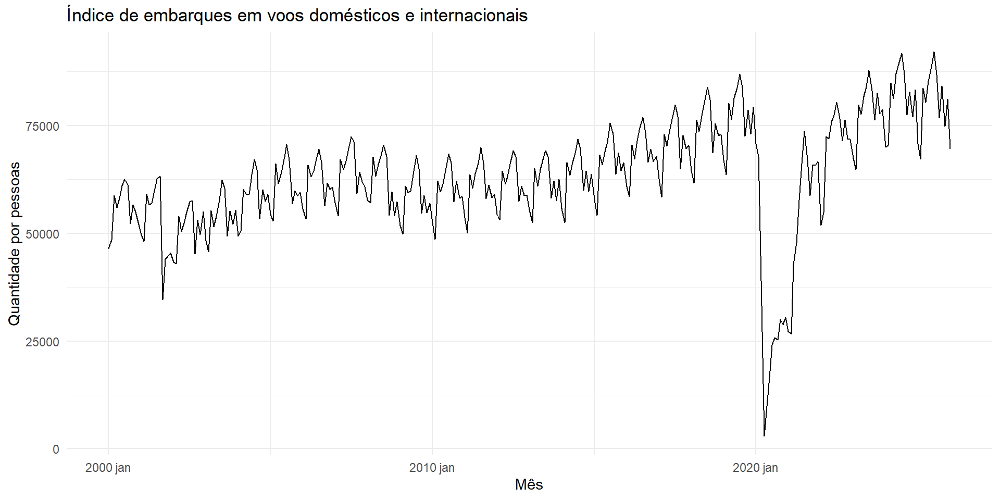{#fig-serie-embarques fig-align="center" width="90%"}

#### Análise Descritiva dos Dados

A série é composta por 313 observações. A @tbl-desc-embarques apresenta as estatísticas descritivas do índice de embarques aéreos nos Estados Unidos para o período analisado.

A média do índice de embarques foi de aproximadamente 63.257 mil passageiros, enquanto a mediana apresentou valor bastante próximo (63.679). A variância de 168.948.078 evidencia uma dispersão considerável dos valores ao longo do período analisado. O desvio padrão de 12.998 reforça essa variabilidade, refletindo tanto a tendência de crescimento observada na série quanto os impactos de eventos que afetaram significativamente o setor aéreo. Por fim, o coeficiente de variação de 20,55% indica variabilidade moderada dos embarques em relação à média da série.

| Parâmetro/Medida  |       Valor |
|-------------------|------------:|
| Nº de observações |         313 |
| Média             |   63.257,44 |
| Mediana           |      63.679 |
| Variância         | 168.948.078 |
| Desvio Padrão     |      12.998 |
| Mínimo            |       3.014 |
| Máximo            |      92.180 |
| CV (%)            |       20,55 |

: Estatísticas descritivas do índice de embarques aéreos nos Estados Unidos. {#tbl-desc-embarques}

#### Análise de Sazonalidade

O gráfico sazonal (@fig-season) mostra as trajetórias anuais da série e revela um padrão de repetição bastante persistente ao longo dos anos: os embarques tendem a ser menores entre janeiro e fevereiro, crescem ao longo do ano atingindo o pico nos meses de junho, julho e agosto — período que inicia o verão e as férias nos EUA —, para então reduzir novamente no final do ano.

{#fig-season fig-align="center"}

O gráfico de subséries (@fig-subseries) reforça essa visualização ao exibir cada mês separadamente, mostrando a desigualdade da média ao longo do ano. Junho, julho e agosto concentram as médias mais altas, enquanto janeiro, fevereiro e setembro registram as mais baixas. Vale destacar ainda que os valores aumentam entre os anos, evidenciando a tendência de crescimento da série.

{#fig-subseries fig-align="center"}

#### ACF e PACF

A @fig-acf-pacf-embarques apresenta as funções de autocorrelação e autocorrelação parcial da série, calculadas conforme as Equações [-@eq-acf] e [-@eq-pacf]. A ACF mostra autocorrelações elevadas que vão caindo de forma lenta, característica de séries com tendência, além de um aumento significativo nos *lags* múltiplos de 12, confirmando a forte sazonalidade. A PACF apresenta uma grande queda após o primeiro *lag*, indicando que o período anterior é o principal responsável por explicar o comportamento atual da série.

::: {#fig-acf-pacf-embarques layout-ncol="2"}
.png){#fig-acf-embarques}

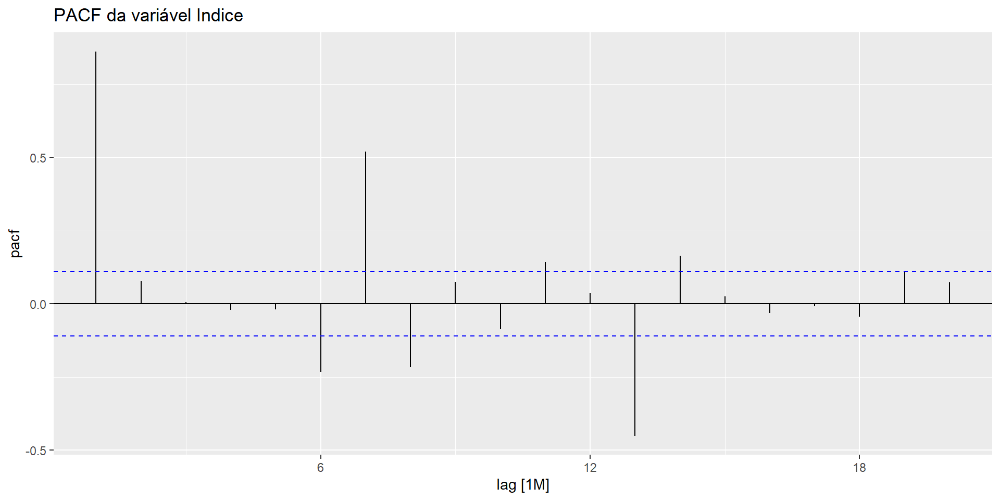{#fig-pacf-embarques}

Funções de autocorrelação (ACF) e autocorrelação parcial (PACF) do índice de embarques.
:::

#### Decomposição Clássica

A @fig-decomp-embarques apresenta a decomposição clássica aditiva (Equação [-@eq-decomp-add]) e multiplicativa (Equação [-@eq-decomp-mult]) da série. Em ambas, é possível identificar claramente três componentes: tendência de crescimento, sazonalidade anual bem definida e resíduos predominantemente aleatórios. As principais exceções ocorrem nos anos de 2001 e 2020, que apresentam comportamentos atípicos em relação ao padrão da série.

::: {#fig-decomp-embarques layout-ncol="2"}
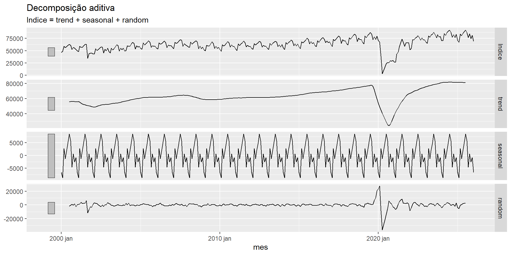{#fig-decomp-aditiva}

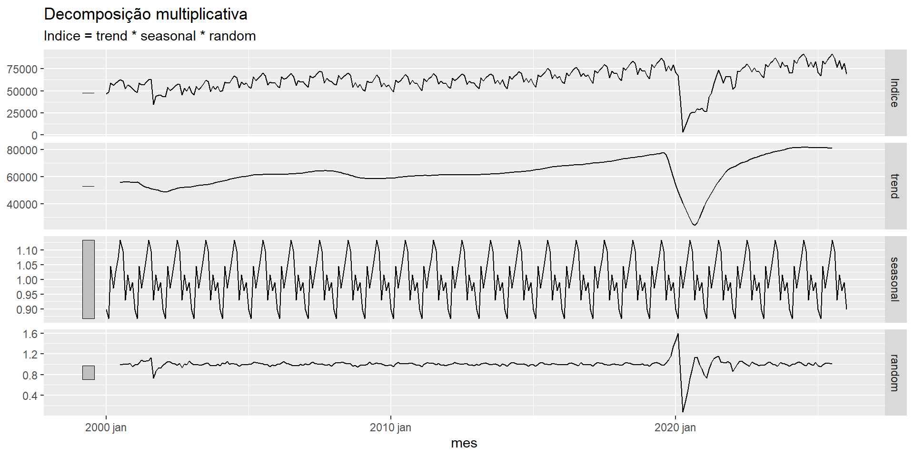{#fig-decomp-mult}

Decomposição clássica da série de embarques.
:::

#### Previsões com Modelos ETS

Foram estimados cinco modelos ETS no conjunto de treinamento e geradas previsões para os 12 meses do período de teste. A @fig-previsao-embarques apresenta as previsões de todos os modelos simultaneamente. Os modelos com componente sazonal (HW_Add e HW_Mult) demonstram ser mais semelhantes à trajetória da série, enquanto os modelos sem componente sazonal (SES, HoltA e HoltM) tendem a subestimar de forma consistente os picos observados durante o verão.

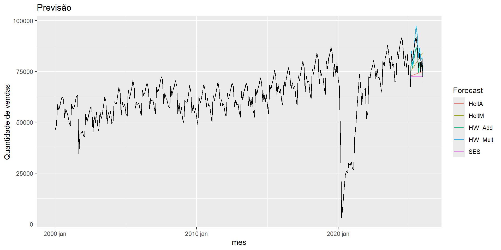{#fig-previsao-embarques fig-align="center" width="85%"}

A @tbl-acuracia-embarques apresenta as métricas de acurácia (Equações [-@eq-me-rmse-mae] a [-@eq-acf1]) dos modelos ETS no conjunto de teste.

| Modelo      |        ME |      RMSE |      MAE | MPE (%) |   MAPE (%) | MASE | RMSSE |   ACF1 |
|--------|-------:|-------:|-------:|-------:|-------:|-------:|-------:|-------:|
| **HW_Mult** | −2307,125 |  3531,540 | 3090,553 | −2,8899 | **3,8356** |    — |     — | 0,4882 |
| HW_Add      |  2224,011 |  3682,753 | 3466,555 |  2,4626 |     4,2305 |    — |     — | 0,0737 |
| HoltM       |  1315,229 |  8356,300 | 7442,362 |  0,7463 |     9,3145 |    — |     — | 0,3130 |
| HoltA       |  7031,633 | 10198,870 | 8869,283 |  7,9046 |    10,5939 |    — |     — | 0,1680 |
| SES         |  8358,282 | 11065,679 | 9753,716 |  9,5684 |    11,6199 |    — |     — | 0,1342 |

: Métricas de acurácia dos modelos ETS no conjunto de teste. Nota: MASE e RMSSE retornaram valores ausentes, por isso o MAPE foi utilizado como critério principal de seleção. Melhor MAPE em negrito. {#tbl-acuracia-embarques}

Entre os modelos ETS, o **Holt-Winters Multiplicativo (HW_Mult)** obteve o menor MAPE ($\approx 3{,}84\%$), que é a métrica principal sendo avaliada. Esse resultado é coerente com o comportamento da série, pois a intensidade dos padrões sazonais aumenta à medida que o número de embarques cresce, favorecendo o uso de modelos com sazonalidade multiplicativa em vez de aditiva. A @fig-melhor-embarques apresenta a previsão ajustada à série completa para visualização apenas do melhor modelo.

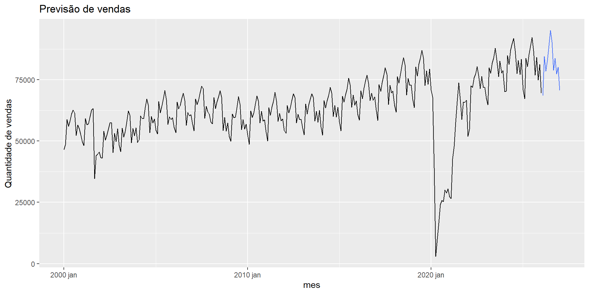{#fig-melhor-embarques fig-align="center" width="85%"}

------------------------------------------------------------------------

### Percentual de Usuários de Internet no Brasil

#### Visualização da Série Original

A @fig-internet-orig apresenta a série do percentual de usuários com acesso à internet no Brasil, a qual apresenta uma forte tendência de crescimento ao longo do período analisado. Entre 1990 e 2000, os percentuais eram próximos de zero; a partir dos anos 2000, ocorreu um crescimento acelerado até aproximadamente 2020. Nos anos mais recentes, esse crescimento começa a desacelerar, indicando uma possível estabilização da série. Ao final de 2024, o percentual de usuários com acesso à internet no Brasil atingiu cerca de 84,5%.

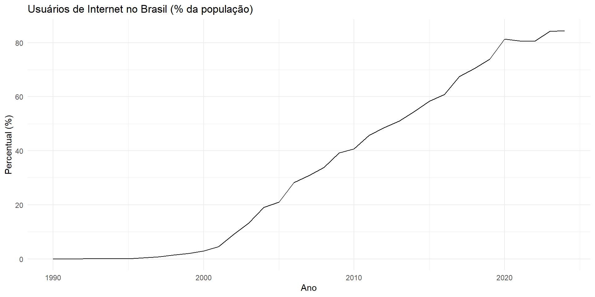{#fig-internet-orig fig-align="center"}

#### Análise Descritiva dos Dados

A série é composta por 35 observações anuais. A @tbl-desc-internet apresenta as estatísticas descritivas.

A média do percentual de usuários de internet foi de aproximadamente 33,99%, enquanto a mediana apresentou valor próximo (30,88%). A variância de 961,44 evidencia uma dispersão considerável dos valores ao longo do período analisado. O desvio padrão de 31,01 pontos percentuais reflete o crescimento acelerado da utilização da internet nas últimas décadas. O coeficiente de variação de 91,23% indica elevada variabilidade em relação à média, comportamento esperado em uma série caracterizada por forte tendência de crescimento.

| Parâmetro/Medida  |  Valor |
|-------------------|-------:|
| Nº de Observações |     35 |
| Média             |  33,99 |
| Mediana           |  30,88 |
| Variância         | 961,44 |
| Desvio Padrão     |  31,01 |
| Mínimo            |   0,00 |
| Máximo            |  84,46 |
| CV (%)            |  91,23 |

: Estatísticas descritivas do percentual de usuários de internet no Brasil. {#tbl-desc-internet}

#### Análise de Sazonalidade

A partir da análise visual da série, é possível identificar que não há evidências de sazonalidade, já que não é possível observar padrões que se repetem ao longo do período analisado. O comportamento da série é predominantemente marcado por uma forte tendência de crescimento, com sinais de desaceleração nos anos finais analisados.

#### ACF e PACF

A @fig-acf-pacf-internet apresenta as funções de autocorrelação e autocorrelação parcial da série de usuários de internet. A ACF apresenta autocorrelações elevadas nos primeiros *lags*, que decaem de forma lenta e gradual, comportamento característico de séries com forte tendência. A PACF apresenta um valor elevado apenas no primeiro *lag* e vai caindo nos *lags* seguintes, indicando que a dependência temporal sofre forte influência da observação anterior. Esses resultados reforçam a presença de uma tendência forte e a ausência de sazonalidade na série.

::: {#fig-acf-pacf-internet layout-ncol="2"}
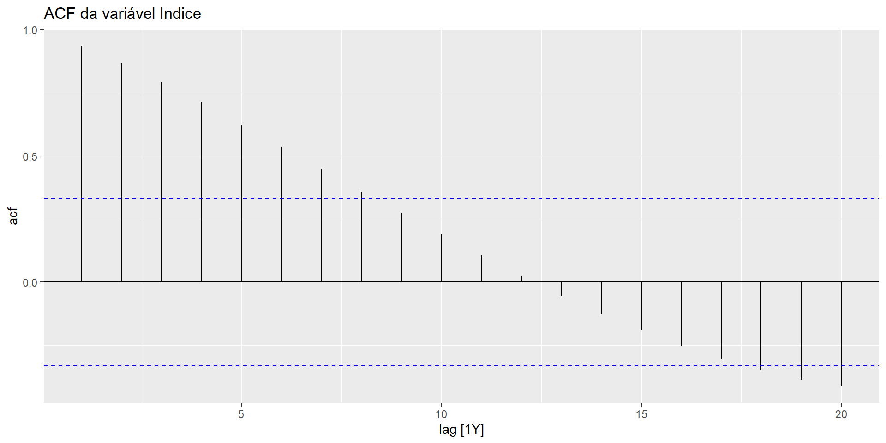{#fig-acf-internet}

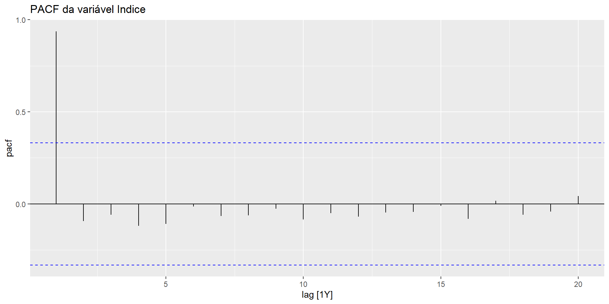{#fig-pacf-internet}

Funções de autocorrelação (ACF) e autocorrelação parcial (PACF) dos usuários de internet no Brasil.
:::

#### Decomposição da Série

A decomposição da série em tendência, componente sazonal e resíduo confirma a ausência de sazonalidade. Como os dados possuem frequência anual, o componente sazonal torna-se praticamente constante, fazendo com que a maior parte da variação observada seja explicada apenas pela tendência. Esse componente evidencia de forma clara o crescimento contínuo do acesso à internet pela população brasileira ao longo das últimas décadas.

#### Previsões com Modelos ETS

Foram estimados cinco modelos ETS sem componente sazonal no conjunto de treinamento e geradas previsões para os 4 anos do período de teste. A @fig-previsao-internet apresenta as previsões de todos os modelos avaliados simultaneamente. Observa-se que os modelos com componente de tendência projetam a continuidade do crescimento da série, enquanto o modelo SES, sem componente de tendência, produz previsões mais estáveis e próximas dos valores observados, acompanhando melhor a desaceleração observada nos anos mais recentes.

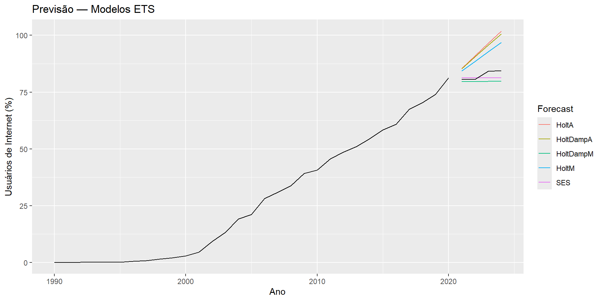{#fig-previsao-internet fig-align="center"}

A @tbl-acuracia-internet apresenta as métricas de acurácia dos modelos ETS no conjunto de teste.

| Modelo    |      ME |   RMSE |    MAE | MPE (%) |  MAPE (%) | MASE | RMSSE |  ACF1 |
|-----------|--------:|-------:|-------:|--------:|----------:|-----:|------:|------:|
| **SES**   |   1,116 |  2,163 |  1,849 |   1,304 | **2,213** |    — |     — | 0,258 |
| HoltDampM |   2,786 |  3,310 |  2,786 |   3,332 |     3,332 |    — |     — | 0,249 |
| HoltM     |  −8,174 |  8,752 |  8,174 |  −9,853 |     9,853 |    — |     — | 0,062 |
| HoltDampA | −10,588 | 11,371 | 10,588 | −12,757 |    12,757 |    — |     — | 0,119 |
| HoltA     | −11,247 | 12,122 | 11,247 | −13,547 |    13,547 |    — |     — | 0,133 |

: Métricas de acurácia dos modelos ETS no conjunto de teste. Nota: MASE e RMSSE retornaram valores ausentes, por isso o MAPE foi utilizado como critério principal de seleção. Melhor MAPE em negrito. {#tbl-acuracia-internet}

Entre os modelos avaliados, o **SES** apresentou o menor MAPE ($\approx 2{,}213\%$), sendo considerado a métrica principal de avaliação. Como o crescimento do acesso à internet vem desacelerando ao longo do tempo, modelos que assumem uma tendência contínua acabam superestimando os valores futuros. O SES, ao utilizar apenas o nível recente da série, consegue acompanhar melhor essa estabilização e representar de forma mais adequada o comportamento observado.

::: callout-warning
**Limitação:** O conjunto de teste desta série é composto por apenas quatro observações (2021–2024), o que representa uma limitação relevante na avaliação do desempenho dos modelos. Com tão poucas observações no período de teste, as métricas de acurácia podem não refletir com fidelidade o comportamento preditivo real dos modelos em horizontes mais longos, devendo os resultados ser interpretados com cautela.
:::

A @fig-melhor-internet apresenta a previsão do modelo SES ajustado à série completa para visualização do melhor modelo.

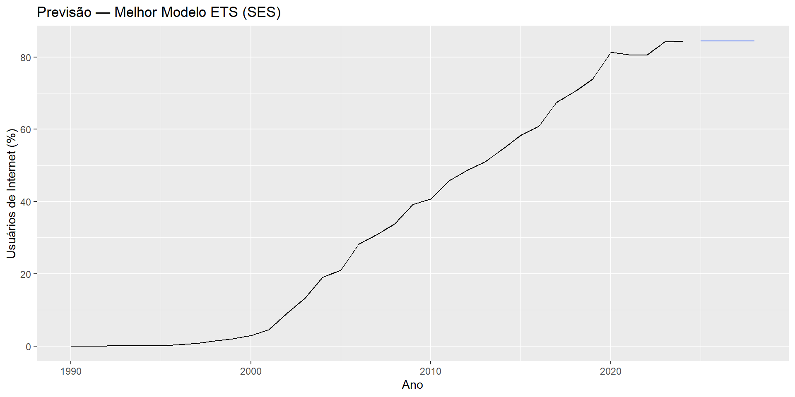{#fig-melhor-internet fig-align="center" width="85%"}

------------------------------------------------------------------------

## Conclusões

A análise das duas séries temporais estudadas permitiu compreender como diferentes comportamentos ao longo do tempo influenciam na escolha dos melhores modelos para previsão. Embora ambas as séries apresentem componente de tendência, suas características são bastante diferentes, exigindo compreensão antes da sua modelagem.

A série de embarques em voos de companhias aéreas nos EUA apresentou crescimento forte ao longo dos anos, acompanhado por sazonalidade bastante evidente. Os resultados mostraram que o número de embarques aumenta durante os meses de verão nos Estados Unidos (maio, junho, julho e agosto), período associado ao aumento das viagens de lazer e férias escolares, enquanto os menores números ocorrem nos meses de inverno (novembro, dezembro, janeiro e fevereiro). Além disso, eventos marcantes como os atentados de 11 de setembro de 2001 e a pandemia de COVID-19 em 2020 provocaram quedas expressivas nos embarques, mostrando a sensibilidade do setor aéreo a fatores externos não previstos.

As análises gráficas, a decomposição da série e as funções de autocorrelação confirmaram a presença de tendência e sazonalidade. Nesse contexto, o modelo **Holt-Winters Multiplicativo (HW_Mult)** apresentou o melhor desempenho entre todos os modelos avaliados, demonstrando maior capacidade de reproduzir os padrões sazonais observados ao longo da série e fornecendo as melhores previsões para o período de teste.

Por sua vez, a série do percentual de usuários de internet no Brasil apresentou um comportamento mais simples, caracterizado por apenas uma forte tendência de crescimento e sem padrões de sazonalidade. Os resultados mostraram o rápido aumento do acesso da população brasileira à internet nas últimas décadas, resultado dos avanços tecnológicos, da ampliação da infraestrutura de telecomunicações e do fortalecimento da inclusão digital da população. Entretanto, também se observou que esse crescimento vem ocorrendo de forma cada vez mais lenta nos anos finais da série, sugerindo aproximação de um nível de estabilidade.

Para essa série, o modelo **SES (Suavização Exponencial Simples)** apresentou o melhor desempenho. Esse resultado mostra que modelos mais complexos nem sempre produzem as melhores previsões, especialmente quando a série apresenta sinais de estabilização e menor ritmo de crescimento nos anos mais recentes.

De modo geral, os resultados obtidos destacam a importância da análise exploratória como etapa fundamental na modelagem de séries temporais. A identificação dos componentes presentes nos dados — como tendência, sazonalidade e possíveis alterações ao longo do tempo — auxilia na escolha dos melhores modelos para cada tipo de situação analisada, contribuindo para previsões mais confiáveis e interpretações mais precisas.

------------------------------------------------------------------------

## Referências {.unnumbered}

::: {#refs}
\[1\] ANTUNES, J. L. F.; CARDOSO, M. R. A. Uso da análise de séries temporais em estudos epidemiológicos. **Epidemiologia e Serviços de Saúde**, Brasília, v. 24, n. 3, p. 565–576, 2015. DOI: 10.5123/S1679-49742015000300024. Disponível em: <https://doi.org/10.5123/S1679-49742015000300024>.

\[2\] BUREAU OF TRANSPORTATION STATISTICS (BTS); FEDERAL RESERVE BANK OF ST. LOUIS (FRED). **Enplanements: Total System – Domestic and International Scheduled Service, Passengers Enplaned by U.S. Air Carriers** \[ENPLANE\]. Disponível em: <https://fred.stlouisfed.org/series/ENPLANE>.

\[3\] BOX, G. E. P.; JENKINS, G. M.; REINSEL, G. C.; LJUNG, G. M. **Time Series Analysis: Forecasting and Control**. 5. ed. Hoboken: Wiley, 2015.

\[4\] CHATFIELD, C. **The Analysis of Time Series: An Introduction**. 6. ed. Boca Raton: Chapman & Hall/CRC, 2004.

\[5\] FEDERAL RESERVE BANK OF ST. LOUIS. **FRED: Federal Reserve Economic Data**. St. Louis, 2026. Disponível em: <https://fred.stlouisfed.org>.

\[6\] FRAZÃO, J. A. F.; OLIVEIRA, A. V. M. de. Distribuição de renda e demanda por transporte aéreo: uma especificação de modelo econométrico para o mercado doméstico brasileiro. **Transportes**, v. 28, n. 3, p. 1–13, 2020. DOI: 10.14295/transportes.v28i5.1662. Disponível em: <https://transportes.anpet.org.br/anpet/article/view/1662>.

\[7\] GROLEMUND, G.; WICKHAM, H. Dates and times made easy with lubridate. **Journal of Statistical Software**, v. 40, n. 3, p. 1–25, 2011. DOI: 10.18637/jss.v040.i03. Disponível em: <https://www.jstatsoft.org/article/view/v040i03>.

\[8\] HYNDMAN, R. J.; KOEHLER, A. B.; ORD, J. K.; SNYDER, R. D. **Forecasting with Exponential Smoothing: The State Space Approach**. Berlin: Springer, 2008.

\[9\] HYNDMAN, R. J.; ATHANASOPOULOS, G. **Forecasting: Principles and Practice**. 3. ed. Melbourne: OTexts, 2021. Disponível em: <https://otexts.com/fpp3>.

\[10\] MORETTIN, Pedro A.; TOLOI, Clélia M. C. **Análise de séries temporais: modelos lineares univariados**. São Paulo: Editora Blucher, 2018. 474 p. ISBN 978-85-212-1352-9.

\[11\] O'GRADY, M.; HYNDMAN, R. J.; WANG, E. **feasts: Feature Extraction and Statistics for Time Series**. R package version 0.3.0, 2021. Disponível em: <https://CRAN.R-project.org/package=feasts>.

\[12\] OLIVEIRA, Alessandro Vinícius Marques de. **Transporte aéreo: economia e políticas públicas**. São Paulo: Pezco Editora, 2009. ISBN 978-85-62305-00-9. Disponível em: <https://arxiv.org/abs/2402.07190>.

\[13\] POSIT TEAM. **RStudio: Integrated Development Environment for R**. Boston: Posit Software, PBC, 2025. Disponível em: <http://www.posit.co/>.

\[14\] R CORE TEAM. **R: A Language and Environment for Statistical Computing**. Vienna: R Foundation for Statistical Computing, 2024. Disponível em: <https://www.R-project.org/>.

\[15\] UNIÃO INTERNACIONAL DE TELECOMUNICAÇÕES (UIT). **Measuring digital development: Facts and Figures**. Genebra: ITU Publications, 2023. Disponível em: <https://www.itu.int/itu-d/reports/statistics/>.

\[16\] WANG, E.; COOK, D.; HYNDMAN, R. J. A new tidy data structure to support exploration and modeling of temporal data. **Journal of Computational and Graphical Statistics**, v. 29, n. 3, p. 466–478, 2020. Disponível em: <https://arxiv.org/abs/1901.10257>.

\[17\] WICKHAM, H.; FRANÇOIS, R.; HENRY, L.; MÜLLER, K.; VAUGHAN, D. **dplyr: A Grammar of Data Manipulation**. R package version 1.1.4, 2023. Disponível em: <https://CRAN.R-project.org/package=dplyr>.

\[18\] WICKHAM, H. **ggplot2: Elegant Graphics for Data Analysis**. New York: Springer-Verlag, 2016. Disponível em: <https://ggplot2-book.org/>.

\[19\] WICKHAM, H.; HESTER, J.; BRYAN, J. **readr: Read Rectangular Text Data**. R package version 2.1.4, 2023. Disponível em: <https://CRAN.R-project.org/package=readr>.

\[20\] WICKHAM, H.; VAUGHAN, D.; GIRLICH, M. **tidyr: Tidy Messy Data**. R package version 1.3.2, 2025. Disponível em: <https://CRAN.R-project.org/package=tidyr>.

\[21\] WORLD BANK; FEDERAL RESERVE BANK OF ST. LOUIS (FRED). **Individuals Using the Internet (% of Population) for Brazil** \[ITNETUSERP2BRA\]. Disponível em: <https://fred.stlouisfed.org/series/ITNETUSERP2BRA>.
:::
